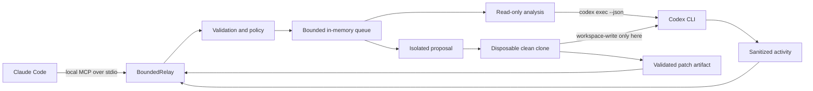

<p align="center">
  
</p>

# BoundedRelay

<p align="center">
  <strong>Policy-first MCP delegation for coding agents.</strong><br>
  A policy-bounded Claude-to-Codex worker for bounded analysis, isolated proposals, live progress, and reviewable results.
</p>

<p align="center">
  
  
  
  
</p>

BoundedRelay lets Claude Code hand a well-scoped task to the locally installed
Codex CLI over MCP. The call returns immediately with a job handle. Claude can
then show what the worker is doing, wait efficiently for the next real update,
retrieve the result, or cancel the job.

```text
Claude Code  ── local MCP/stdio ──>  BoundedRelay  ── codex exec --json ──>  Codex
                                             │
                                             ├─ policy and resource limits
                                             ├─ sanitized live activity
                                             └─ isolated proposal clone
```

The supported v0.1 topology is deliberately one-way: **Claude Code →
BoundedRelay → Codex**. BoundedRelay does not provide a Codex-to-Claude return
route, and the worker never applies generated changes to the source repository.

> [!IMPORTANT] BoundedRelay is an independent community project. It is not
> affiliated with, endorsed by, or maintained by Anthropic or OpenAI. Claude,
> Claude Code, Codex, and OpenAI are trademarks of their respective owners.

Version `0.1.0` is a local development release. The npm package is not published
yet, and v0.1 has no remote service, daemon, database, persistent job store, or
audit ledger.

## Why BoundedRelay

- **Visible instead of frozen:** safe activity labels, event counters, elapsed
  time, time since the last update, queue position, and revision-aware polling.
- **Read-only by default:** analysis always requests Codex's `read-only`
  sandbox.
- **Bounded authority:** the server owns workspace roots, model overrides,
  environment forwarding, timeouts, concurrency, output, and patch limits.
- **Review before mutation:** proposal mode works in a disposable clone,
  validates the resulting patch, and never applies it.
- **No fake progress:** BoundedRelay reports observed lifecycle activity. It
  does not invent a percentage complete or an ETA.
- **Small public surface:** focused MCP tools for capability discovery,
  workspace inspection, submit, status, result, cancellation, and history.

### What Claude can display while Codex works

`codex_worker_status` returns a sanitized snapshot like this:

```json
{
  "status": "running",
  "revision": 14,
  "progress": {
    "phase": "working",
    "activity": "running_command",
    "activityLabel": "Codex is running a sandboxed command",
    "eventCount": 8,
    "commandCount": 2,
    "messageCount": 0,
    "lastEventType": "item.started",
    "updatedAt": "2026-08-27T18:30:00.000Z",
    "elapsedMs": 12420,
    "sinceLastUpdateMs": 180
  }
}
```

The status surface exposes a fixed, server-owned activity vocabulary. It does
not expose chain-of-thought, command text, tool arguments, repository file paths
from events, or arbitrary Codex event payloads.

## Where this fits

For general Claude Code-to-Codex delegation, first evaluate OpenAI's official
[`openai/codex-plugin-cc`](https://github.com/openai/codex-plugin-cc). Use
BoundedRelay when you specifically need a local MCP policy boundary around the
Codex subprocess.

| Need                                                                                   | Start with               |
| -------------------------------------------------------------------------------------- | ------------------------ |
| Vendor-supported Claude Code plugin UX and built-in review flows                       | `openai/codex-plugin-cc` |
| Local stdio tools with server-owned workspace, environment, model, and resource policy | BoundedRelay             |
| Sanitized live job state with revision-aware long-polling                              | BoundedRelay             |
| Revision-pinned patch from a disposable clone, never auto-applied                      | BoundedRelay             |
| Persistent jobs, a daemon, remote multi-user service, or an audit ledger               | Not provided by v0.1     |

See the detailed [comparison](docs/comparison-with-codex-plugin-cc.md).

## Prerequisites

- Node.js `>=22.13.0` and npm;
- Git available on `PATH`;
- Codex CLI installed and authenticated for the current operating-system user;
- Claude Code with local stdio MCP support;
- a Git repository for each delegated task.

BoundedRelay uses the supported `codex exec --json` non-interactive interface.
It has no credential input and no credential store. Saved Codex authentication
is used through the normal user environment; direct API-token forwarding is a
separate opt-in.

## Quick start from source

The package is **not on npm yet**. Clone or download this repository and run it
locally.

### 1. Install, verify, and inspect the local environment

```bash
git clone <repository-url> bounded-relay
cd bounded-relay
npm ci
npm run check
node dist/cli.js doctor
```

`doctor` checks Node-facing dependencies, Codex command compatibility, Git, and
Codex login state without making a model call.

### 2. Register the built worker with Claude Code

Run this from the BoundedRelay directory so the shell records an absolute path.
User scope is the recommended personal default because the same installation is
available when Claude Code opens other projects:

```bash
WORKER_ENTRY="$(pwd)/dist/cli.js"

claude mcp add \
  --transport stdio \
  --scope user \
  bounded-relay \
  -- node "$WORKER_ENTRY" serve
```

`--scope user` is personal to your operating-system account and is not committed
to a repository. To keep the registration local to one project instead, change
to the **target Git repository** before running the command and use
`--scope local`; local scope belongs to the project in which the command is
executed.

Then verify:

```bash
claude mcp list
```

Inside Claude Code, run `/mcp`. `bounded-relay` should show as connected.

### 3. Run the first read-only delegation

Open Claude Code inside a Git repository and ask:

```text
Use bounded-relay to inspect this workspace and start a read-only architecture review.
Poll codex_worker_status with afterRevision so you show each new activity without spam.
When the job completes, retrieve the result and summarize only high-confidence findings.
```

Claude should use `codex_worker_workspace`, `codex_worker_analyze`,
`codex_worker_status`, and `codex_worker_result`.

For macOS, Linux, Windows PowerShell, project-scoped configuration, removal,
upgrades, and common setup failures, read the complete
[installation and first-run guide](docs/getting-started.md).

## MCP tools

| Tool                        | Purpose                                                                                       |
| --------------------------- | --------------------------------------------------------------------------------------------- |
| `codex_worker_capabilities` | Report compatibility, login readiness, effective limits, proposal availability, and warnings. |
| `codex_worker_workspace`    | Resolve a directory, its Git boundary, exact revision, cleanliness, and proposal readiness.   |
| `codex_worker_analyze`      | Queue a bounded read-only Codex job.                                                          |
| `codex_worker_propose`      | Queue an isolated patch proposal; registered only with `CCW_ENABLE_PROPOSALS=true`.           |
| `codex_worker_status`       | Read sanitized activity now or wait for a revision newer than `afterRevision`.                |
| `codex_worker_result`       | Read a terminal result; proposal patch text requires `includePatch=true`.                     |
| `codex_worker_cancel`       | Cancel a queued or running job. Repeated cancellation is safe.                                |
| `codex_worker_list`         | List bounded process-lifetime job history as `{ "jobs": [...] }`.                             |

The stable v0.1 protocol/configuration namespaces remain `codex_worker_*` and
`CCW_*`. The public brand is BoundedRelay; keeping those explicit namespaces
avoids a needless breaking migration before the contract stabilizes.

Read the full [tool reference](docs/tool-reference.md), including every activity
state, input, output, and failure code.

## Safety contract

### Analyze mode — default

- Requests Codex's `read-only` sandbox in a canonical allowed Git repository.
- Rejects proposal-only fields such as `writePaths` and `expectedRevision`.
- Returns Codex's final analysis plus observed usage metadata.

### Proposal mode — disabled by default

- Is registered only when the server starts with `CCW_ENABLE_PROPOSALS=true`.
- Requires a clean source tree, an exact full Git object ID, and explicit
  repository-relative write paths.
- Creates a clean disposable clone at the pinned revision.
- Runs `workspace-write` inside that clone only.
- Rejects changed refs, changed `HEAD`, out-of-scope files, protected paths,
  symlink changes, oversized patches, and excessive changed-file counts.
- Returns a validated full-index binary patch and SHA-256 digest, then deletes
  the clone.
- Never applies, commits, pushes, publishes, or deploys the patch.

Enable it only after read-only mode is working:

```bash
claude mcp remove bounded-relay --scope user

claude mcp add \
  --env CCW_ENABLE_PROPOSALS=true \
  --transport stdio \
  --scope user \
  bounded-relay \
  -- node /absolute/path/to/bounded-relay/dist/cli.js serve
```

`codex_worker_result` omits patch text by default. A caller must request
`includePatch=true`, verify the returned digest, review the content, and decide
separately whether to apply it. Read the complete
[security model](docs/security-model.md) before enabling proposals.

## Architecture



See [Architecture](docs/architecture.md) and the
[architecture decision records](docs/adr/README.md).

## Optional Spec Kit workflow

Spec Kit is useful for substantial consumer-project features because it creates
reviewable specification, plan, and task artifacts before implementation. It is
intentionally **not** a BoundedRelay runtime dependency and this repository does
not vendor a `.specify/` workspace.

The recommended integration adds three review gates:

1. Claude drafts the Spec Kit plan; Codex performs a bounded read-only plan
   review before tasks are finalized.
2. After tasks are generated and Spec Kit analysis passes, Codex checks
   `spec.md`, `plan.md`, and `tasks.md` as one cross-artifact contract.
3. After implementation and project checks, Claude reviews the diff and Codex
   independently checks it against the approved artifacts.

A strict gate reviews committed artifacts in a clean workspace, records the
exact Git HEAD and artifact revision, and becomes stale after any reviewed
artifact or HEAD change. A draft review may inspect uncommitted work, but its
unversioned findings are advisory and cannot satisfy a strict gate.

Use the pinned, optional
[Spec Kit integration guide](docs/integrations/spec-kit.md).

## Configuration

Safe defaults require no project configuration.

| Variable                 | Default                               | Meaning                                              |
| ------------------------ | ------------------------------------- | ---------------------------------------------------- |
| `CCW_ALLOWED_ROOTS`      | `CLAUDE_PROJECT_DIR`, then server cwd | Platform-delimited directories the worker may enter. |
| `CCW_ENABLE_PROPOSALS`   | `false`                               | Register the isolated proposal tool.                 |
| `CCW_MAX_CONCURRENT`     | `2`                                   | Active Codex jobs in this server process.            |
| `CCW_MAX_QUEUED`         | `32`                                  | Maximum queued jobs.                                 |
| `CCW_DEFAULT_TIMEOUT_MS` | `1200000`                             | Default job timeout.                                 |
| `CCW_MAX_TIMEOUT_MS`     | `1800000`                             | Maximum caller-selected timeout.                     |
| `CCW_FORWARD_AUTH_ENV`   | `false`                               | Forward known API-token variables to Codex.          |
| `CCW_FORWARD_ENV`        | empty                                 | Extra environment variable names to forward.         |

Read [Configuration](docs/configuration.md) before forwarding secrets or
enabling proposals.

## What BoundedRelay does not claim

- It does not select an objectively “best” model. Optional model and reasoning
  values remain explicit, server-allowlisted choices.
- It does not guarantee better code, lower token usage, or lower cost.
- It does not expose private chain-of-thought as progress.
- It does not keep jobs alive after the stdio server process exits.
- It does not prevent writes made manually or by unrelated tools.
- It does not make Codex offline or change provider retention policies.
- It does not auto-apply, commit, push, publish, deploy, or mutate remote state.

## Documentation

- [Getting started](docs/getting-started.md)
- [Documentation index](docs/README.md)
- [Architecture](docs/architecture.md)
- [Security model](docs/security-model.md)
- [Live status and MCP tools](docs/tool-reference.md)
- [Configuration](docs/configuration.md)
- [Compatibility](docs/compatibility.md)
- [Spec Kit integration](docs/integrations/spec-kit.md)
- [Troubleshooting](docs/troubleshooting.md)
- [Development](docs/development.md)
- [Roadmap](docs/roadmap.md)
- [Recipes](docs/recipes/README.md)
- [Brand assets and generation notes](docs/assets/README.md)

## Project status

`0.1.0` is intentionally pre-stable. Contracts may change before `1.0.0`. Check
[CHANGELOG.md](CHANGELOG.md) and [compatibility notes](docs/compatibility.md)
before upgrading.

## Contributing, security, and support

- Read [CONTRIBUTING.md](CONTRIBUTING.md) before opening a pull request.
- Report vulnerabilities privately through [SECURITY.md](SECURITY.md).
- Use [SUPPORT.md](SUPPORT.md) for support boundaries and diagnostic details.

## License

[MIT](LICENSE)
