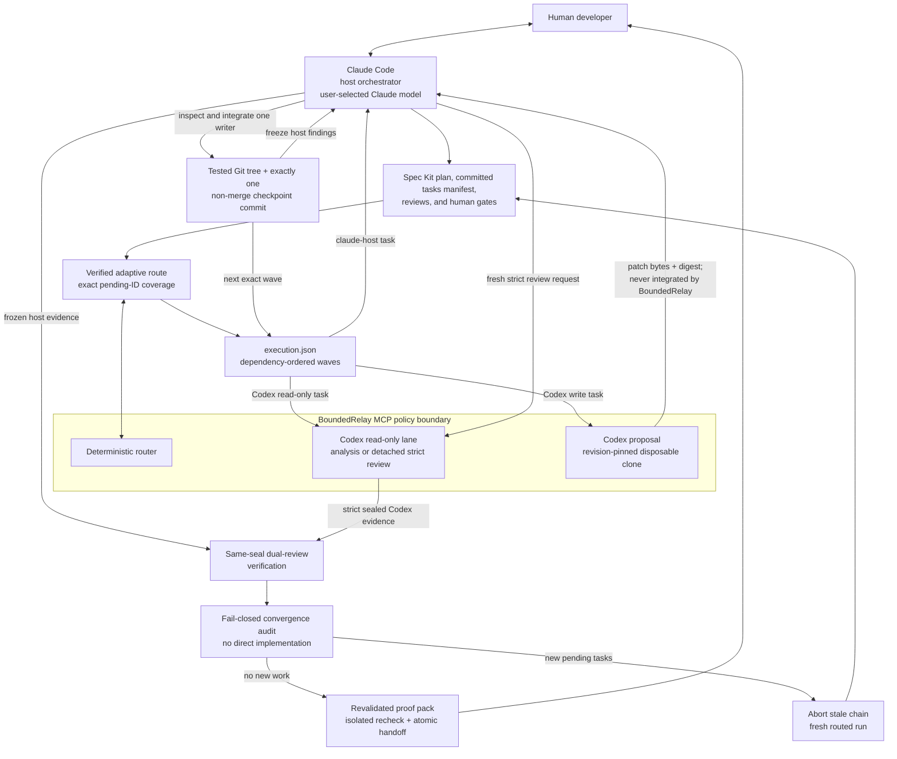
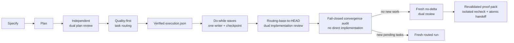

<p align="center">
  
</p>

# BoundedRelay

<p align="center">
  <strong>A policy-first Claude-to-Codex orchestration boundary.</strong><br>
  A policy-bounded Claude-to-Codex worker for deterministic task routing, independent review, isolated proposals, live progress, and reviewable results.
</p>

<p align="center">
  
  
  
  
</p>

BoundedRelay lets Claude Code hand a well-scoped task to the locally installed
Codex CLI over MCP. The call returns immediately with a job handle. Claude can
then show what the worker is doing, wait efficiently for the next real update,
retrieve the result, or cancel the job.

```text
Claude Code  ── local MCP/stdio ──>  BoundedRelay  ── codex exec --json ──>  Codex
                                             │
                                             ├─ policy and resource limits
                                             ├─ deterministic SDD routing
                                             ├─ content-addressed dual review
                                             ├─ sanitized live activity
                                             └─ isolated proposal clone
```

The supported v0.1 topology is deliberately one-way: **Claude Code →
BoundedRelay → Codex**. BoundedRelay does not provide a Codex-to-Claude return
route, and the worker never applies generated changes to the source repository.

> [!IMPORTANT] BoundedRelay is an independent community project. It is not
> affiliated with, endorsed by, or maintained by Anthropic or OpenAI. Claude,
> Claude Code, Codex, and OpenAI are trademarks of their respective owners.

Version `0.1.0` is a local development release. The npm package is not published
yet, and v0.1 has no remote service, daemon, database, persistent job store, or
audit ledger.

## Why BoundedRelay

- **Visible instead of frozen:** safe activity labels, event counters, elapsed
  time, time since the last update, queue position, and revision-aware polling.
- **Read-only by default:** analysis always requests Codex's `read-only`
  sandbox.
- **Bounded authority:** the server owns workspace roots, model overrides,
  environment forwarding, timeouts, concurrency, output, and patch limits.
- **Review before mutation:** proposal mode works in a disposable clone,
  validates the resulting patch, and never applies it to the source worktree.
- **Adaptive work division:** the optional SDD router selects the best versioned
  task-kind/lane fit first, uses preference and a neutral share only after fit
  ties, and emits dependency-safe waves with at most one writer each.
- **Portable policy profiles:** an opt-in, separate profiled route can apply
  reviewed capability fit, narrower write scopes, required check digests, and
  exact Codex policy without executable plugins or broader server authority.
- **Checkpointed execution:** the optional Spec Kit pack turns a verified route
  into `execution.json`, runs one exact dependency wave at a time, and requires
  each writer checkpoint to be one non-merge commit directly parented by the
  active baseline.
- **Independent strict review:** Claude host evidence is frozen before a fresh
  schema-constrained Codex review in a detached read-only clone, and both
  approvals must match one current content-addressed seal.
- **No fake progress:** BoundedRelay reports observed lifecycle activity. It
  does not invent a percentage complete or an ETA.
- **Explicit public surface:** focused MCP tools for capability discovery,
  workspace inspection, routing, review, submit, status, result, cancellation,
  and history.

### What Claude can display while Codex works

`codex_worker_status` returns a sanitized snapshot like this:

```json
{
  "status": "running",
  "revision": 14,
  "progress": {
    "phase": "working",
    "activity": "running_command",
    "activityLabel": "Codex is running a sandboxed command",
    "eventCount": 8,
    "commandCount": 2,
    "messageCount": 0,
    "lastEventType": "item.started",
    "updatedAt": "2026-08-27T18:30:00.000Z",
    "elapsedMs": 12420,
    "sinceLastUpdateMs": 180
  }
}
```

The status surface exposes a fixed, server-owned activity vocabulary. It does
not expose chain-of-thought, command text, tool arguments, repository file paths
from events, or arbitrary Codex event payloads.

## Where this fits

For general Claude Code-to-Codex delegation, first evaluate OpenAI's official
[`openai/codex-plugin-cc`](https://github.com/openai/codex-plugin-cc). Use
BoundedRelay when you specifically need a local MCP policy boundary around the
Codex subprocess.

| Need                                                                                   | Start with               |
| -------------------------------------------------------------------------------------- | ------------------------ |
| Vendor-supported Claude Code plugin UX and built-in review flows                       | `openai/codex-plugin-cc` |
| Local stdio tools with server-owned workspace, environment, model, and resource policy | BoundedRelay             |
| Sanitized live job state with revision-aware long-polling                              | BoundedRelay             |
| Deterministic quality-first SDD routing without a model call                           | BoundedRelay             |
| Strict host-then-Codex review tied to one current artifact seal                        | BoundedRelay             |
| Revision-pinned patch from a disposable clone, never auto-applied to source            | BoundedRelay             |
| Persistent jobs, a daemon, remote multi-user service, or an audit ledger               | Not provided by v0.1     |

See the [feature comparison](docs/feature-comparison.md) for a capability-level
table against the nearest projects, the detailed
[official-plugin comparison](docs/comparison-with-codex-plugin-cc.md), and the
broader, non-ranking [ecosystem comparison](docs/ecosystem-comparison.md).

## Prerequisites

- Node.js `^22.13.0 || ^24.0.0` and npm;
- Git available on `PATH`;
- Codex CLI installed and authenticated for the current operating-system user;
- Claude Code with local stdio MCP support;
- a Git repository for each delegated task.

BoundedRelay uses the supported `codex exec --json` non-interactive interface.
It has no credential input and no credential store. Saved Codex authentication
is used through the normal user environment; direct API-token forwarding is a
separate opt-in.

> [!WARNING] Before the first delegation, review the repository and task data
> you are willing to share. Codex CLI may send task text and repository content
> it reads to OpenAI under your Codex account and provider settings.
> BoundedRelay does not make Codex offline or change provider retention terms.

## Quick start from source

The package is **not on npm yet**. Clone or download this repository and run it
locally.

### 1. Install, verify, and inspect the local environment

```bash
git clone https://github.com/mohammad19974/bounded-relay.git
cd bounded-relay
npm ci
npm run check
node dist/cli.js doctor
```

`doctor` checks Node-facing dependencies, Codex command compatibility, Git, and
Codex login state without making a model call.

The release gate does not stop at testing the TypeScript checkout. It builds an
actual npm tarball, installs that artifact into an empty consumer, and verifies
the installed CLI, ESM export, integration pack, and credential-free MCP
handshake. The same installed-package contract runs in CI on Node 22.13 and 24
across Linux, macOS, and Windows.

To inspect the packaged Spec Kit and Claude Code integration without installing
or modifying a consumer repository:

```bash
node dist/cli.js sdd validate
node dist/cli.js sdd path
```

The validator checks packaged files and JSON manifests. It does not invoke or
certify Claude Code; see the [integration guide](docs/integrations/spec-kit.md)
for the separate host-side validation step.

### 2. Register the built worker with Claude Code

Run this from the BoundedRelay directory so the shell records an absolute path.
User scope is the recommended personal default because the same installation is
available when Claude Code opens other projects:

```bash
WORKER_ENTRY="$(pwd)/dist/cli.js"

claude mcp add \
  --transport stdio \
  --scope user \
  bounded-relay \
  -- node "$WORKER_ENTRY" serve
```

`--scope user` is personal to your operating-system account and is not committed
to a repository. To keep the registration local to one project instead, change
to the **target Git repository** before running the command and use
`--scope local`; local scope belongs to the project in which the command is
executed.

Then verify:

```bash
claude mcp list
```

Inside Claude Code, run `/mcp`. `bounded-relay` should show as connected.

### 3. Run the first read-only delegation

Open Claude Code inside a Git repository and ask:

```text
Use bounded-relay to inspect this workspace and start a read-only architecture review.
Poll codex_worker_status with afterRevision so you show each new activity without spam.
When the job completes, retrieve the result and summarize only high-confidence findings.
```

Claude should use `codex_worker_workspace`, `codex_worker_analyze`,
`codex_worker_status`, and `codex_worker_result`.

For macOS, Linux, Windows PowerShell, project-scoped configuration, removal,
upgrades, and common setup failures, read the complete
[installation and first-run guide](docs/getting-started.md).

## MCP tools

| Tool                        | Purpose                                                                                           |
| --------------------------- | ------------------------------------------------------------------------------------------------- |
| `codex_worker_capabilities` | Report compatibility, login readiness, effective limits, proposal availability, and warnings.     |
| `codex_worker_workspace`    | Resolve a directory, its Git boundary, exact revision, cleanliness, and proposal readiness.       |
| `codex_worker_sdd_route`    | Deterministically route a bounded task DAG through the legacy or strict profiled policy path.     |
| `codex_worker_sdd_review`   | Queue a fresh structured Codex review after freezing host evidence and sealing exact artifacts.   |
| `codex_worker_analyze`      | Queue a bounded read-only Codex job; its output is advisory and cannot satisfy a strict SDD gate. |
| `codex_worker_propose`      | Queue an isolated patch proposal; registered only with `CCW_ENABLE_PROPOSALS=true`.               |
| `codex_worker_status`       | Read sanitized activity now or wait for a revision newer than `afterRevision`.                    |
| `codex_worker_result`       | Read a terminal result or structured review; proposal patch text needs `includePatch=true`.       |
| `codex_worker_cancel`       | Cancel a queued or running job. Repeated cancellation is safe.                                    |
| `codex_worker_list`         | List bounded process-lifetime job history as `{ "jobs": [...] }`.                                 |

The stable v0.1 protocol/configuration namespaces remain `codex_worker_*` and
`CCW_*`. The public brand is BoundedRelay; keeping those explicit namespaces
avoids a needless breaking migration before the contract stabilizes.

Read the full [tool reference](docs/tool-reference.md), including every activity
state, input, output, and failure code.

## Safety contract

### Analyze mode — default

- Requests Codex's `read-only` sandbox in a canonical allowed Git repository.
- Rejects proposal-only fields such as `writePaths` and `expectedRevision`.
- Returns Codex's final analysis plus observed usage metadata.

### Adaptive SDD routing — model-free

- Validates and canonicalizes a bounded task DAG without reading files or
  calling a model.
- Uses hard lane eligibility first, then versioned task-kind fit.
- Applies an eligible preference only to an exact base-fit tie, then consults
  neutral effort/task-count shares. It never forces 50/50.
- Returns policy versions, lane-fit evidence, decision stages, reasons,
  deviations, safe waves, and a content fingerprint.
- Never grants direct write authority; each wave has at most one writer.

An optional `projectProfile` uses the separate `sdd-routing-v3` contract. It is
strict non-executable data and can only specialize capability fit, narrow write
scopes, require canonical check-profile digests, and resolve Codex-only policy
inside server configuration. Omit it to preserve the established v0.1 route and
fingerprint. Read [Portable project profiles](docs/project-profiles.md).

### Structured SDD review — read-only

- Freezes normalized Claude host evidence before starting Codex, while keeping
  its conclusions out of the Codex prompt.
- Strict mode requires a clean full revision, seals exact artifact bytes, and
  runs Codex read-only in a detached origin-free clone proven to match the seal.
- Rechecks the source after Codex and passes only when both independent reviews
  approve the same current strict seal.
- Draft mode and generic analysis are advisory and cannot satisfy a strict gate.

### Proposal mode — disabled by default

- Is registered only when the server starts with `CCW_ENABLE_PROPOSALS=true`.
- Requires a clean source tree, an exact full Git object ID, and explicit
  repository-relative write paths.
- Creates a clean disposable clone at the pinned revision.
- Runs `workspace-write` inside that clone only.
- Rejects changed refs, changed `HEAD`, out-of-scope files, protected paths,
  symlink changes, oversized patches, and excessive changed-file counts.
- Returns a validated full-index binary patch and SHA-256 digest, then deletes
  the clone.
- Never applies the patch to source, commits, pushes, publishes, or deploys it.

Enable it only after read-only mode is working:

```bash
claude mcp remove bounded-relay --scope user

claude mcp add \
  --env CCW_ENABLE_PROPOSALS=true \
  --transport stdio \
  --scope user \
  bounded-relay \
  -- node /absolute/path/to/bounded-relay/dist/cli.js serve
```

`codex_worker_result` omits patch text by default. A caller must request
`includePatch=true`, verify the returned digest, review the content, and decide
separately whether to apply it. Read the complete
[security model](docs/security-model.md) before enabling proposals.

## Architecture



Claude Code is the single host orchestrator. Opus, Sonnet, and other Claude
models are possible user-selected host models, not separate agents in this
diagram. BoundedRelay never starts Claude or turns those model choices into a
three-model orchestration system.

**Orchestrator** means the Claude Code host coordinates commands, artifacts,
gates, provider calls, and the authorized integration. It is not a third model,
a model selector, or an automatic merger. BoundedRelay is the local
**orchestration boundary** and Codex worker control plane; calling it a
symmetric Claude/Codex orchestrator would overstate its authority.

See [Architecture](docs/architecture.md) and the
[architecture decision records](docs/adr/README.md).

## Plan, execution, and review: before vs. with BoundedRelay

This is a qualitative comparison of workflow architecture, not a benchmark.
Actual correctness, speed, token use, and cost depend on the task, models,
prompts, repository, and account; no improvement or savings are guaranteed. Any
example effort points or provider shares are illustrative planning metadata, not
measured usage, quality scores, or benchmark results.

| Phase     | Typical workflow without this boundary                                                | With BoundedRelay and the optional Adaptive SDD pack                                                                                                                                                    |
| --------- | ------------------------------------------------------------------------------------- | ------------------------------------------------------------------------------------------------------------------------------------------------------------------------------------------------------- |
| Plan      | One model may plan, choose an implementer informally, and continue from mutable text. | A frozen host-then-Codex plan review remains an ancestor of routing; unchanged `spec.md`/`plan.md` and the complete strict evidence are revalidated before the committed `tasks.md` manifest is routed. |
| Execution | Parallel or sequential edits may start from different states and rely on prose scope. | Routing must cover every pending standard task ID exactly once before it creates `execution.json`; each writer wave produces one direct-child non-merge commit whose tested tree is verified.           |
| Review    | Reviewers may inspect different revisions or trust a summary of what ran.             | High/Critical findings block approval; chained reviews and the proof pack revalidate source history, while convergence may only confirm no new work or require a fresh routed run.                      |

### Machine-verifiable workflow controls

This table compares enforceable workflow properties, not model intelligence or
output quality. The local conformance corpus checks routing-policy invariants;
it makes no provider call and does not measure speed, tokens, price, or code
correctness.

| Dimension             | Informal workflow gap                                         | Enforced control                                                              | Machine-verifiable evidence                                                   | Limitation                                                               |
| --------------------- | ------------------------------------------------------------- | ----------------------------------------------------------------------------- | ----------------------------------------------------------------------------- | ------------------------------------------------------------------------ |
| Planning              | Mutable prose can drift after review.                         | Plan evidence is revision-bound and revalidated before routing.               | Artifact digests, revision seals, and strict gate status.                     | A valid plan can still be incomplete or technically wrong.               |
| Task routing          | Assignment rationale may be implicit or change between runs.  | Hard eligibility and versioned fit precede preferences and neutral balance.   | Canonical input, policy versions, decision stages, reasons, and fingerprint.  | Fit values are policy data, not vendor benchmarks.                       |
| Write scope           | A writer may receive only a prose ownership hint.             | Write tasks declare repository-relative scopes; proposals are path-validated. | Normalized scopes, changed-path validation, patch digest, and tested tree.    | Host-side compliance remains cooperative until checkpoint validation.    |
| Concurrent edits      | Parallel writers can race or invalidate each other's base.    | Dependency waves permit at most one writer and require a direct-child commit. | Wave ledger, parent revision, commit shape, and dependency replay.            | The design deliberately trades write parallelism for integration safety. |
| Independent review    | Reviewers may inspect different content or mutable summaries. | Host evidence is frozen before a fresh Codex review of the same sealed state. | Matching seal, review IDs, structured findings, and freshness recheck.        | Structured approval cannot prove a reviewer found every defect.          |
| Delivery traceability | Commands and patches may not be tied to the delivered tree.   | Check receipts, proposal bytes, checkpoints, and proof packs are tree-bound.  | Command/output digests, patch-to-tree reconstruction, and proof verification. | Digests are content addresses, not signed CI or identity attestations.   |

The governed path is deliberately sequential at its trust boundaries:



## Optional Spec Kit workflow

This source repository uses `.specify/` for its own substantial changes, but
Spec Kit is intentionally **not** a BoundedRelay runtime dependency. The npm
package includes an original optional Spec Kit workflow/extension and Claude
Code plugin under `integrations/`; it does not install either one automatically.

The workflow freezes Claude's host review before a fresh Codex review, routes
approved tasks through `codex_worker_sdd_route`, verifies `routing.json`, and
then creates `execution.json`. A Spec Kit `do-while` executes the canonical
dependency waves in order. Every wave starts from the previous verified clean
commit, processes ready read-only tasks before its single possible writer, and
must record accepted results plus check receipts before a human checkpoint can
advance it. The default 5,000-basis-point Codex share is neutral metadata, not a
quota. Eligibility and fit may legitimately produce any actual share, including
every implementation task on one lane.

Routing is prepared from the exact committed `tasks.md` at its revision. Its
standard checkbox task IDs (`T###` or longer) form a content-addressed manifest,
and assignments must cover every incomplete ID exactly once without routing a
completed or invented ID. The approved plan-review revision must be an ancestor
of that task checkpoint; `spec.md` and `plan.md` must be unchanged, and the
complete strict plan evidence is revalidated before routing can continue.

Check receipts are redacted coordinator-attested digest records for commands,
outputs, working directory, zero exit status, timestamps, and the exact Git tree
tested. Writer receipts must match that wave's checkpoint tree; convergence
receipts must match its sealed review tree. They are not signed CI attestations,
do not contain raw output, and cannot independently prove that the coordinator
ran the claimed command.

Codex write slices remain isolated proposals. Their exact patch bytes are kept
only at the ignored run-local `patches/<task-id>.patch`; the execution validator
recomputes the digest, applies those bytes to a disposable Git index at the
active baseline, and requires the resulting tree to equal the checkpoint tree.
Each writer checkpoint must be exactly one non-merge commit whose sole parent is
the active baseline. Claude Code or the human coordinator inspects and
integrates a patch—BoundedRelay never does. A rejected gate aborts that evidence
chain. Correct the artifacts or code and start a fresh run; do not reuse the
rejected route, execution ledger, review, or proof pack.

Every Codex execution result records `model` and `reasoningEffort` (including
`null` when the route uses server defaults), and both must exactly match the
routed policy. The legacy no-profile workflow uses its fixed allowlisted
`gpt-5.6-sol` / `ultra` policy for critical work. A project profile instead
requires an explicit `codexPolicy.byRisk.critical` pair and never substitutes a
different model or effort. The host model remains whatever the user selected in
Claude Code.

Implementation review compares the approved routing base revision with final
`HEAD` and rejects a scope above 256 changed paths. Convergence is fail-closed:
it audits only, never implements directly. If it appends new pending tasks, the
current evidence chain stops and those tasks require a fresh route and wave run;
only a no-change result may proceed to a no-delta review based on the approved
implementation revision. For implementation and convergence, the frozen host
review ID binds the run, phase, nonce, sealed revision, source-evidence digest,
check digest, and prepared Codex review policy. The final digest-only
`proof-pack.json` statically revalidates the full routing projections, exact
execution-to-implementation-to-convergence source chains, historical wave
checkpoints, strict evidence, and current convergence freshness. It indexes
digests and accepted identifiers without copying prompts or raw provider output.

After proof approval, Claude writes only a run-local `handoff-draft.md`. The
verifier copies the final revision and run evidence into an isolated Git clone,
revalidates the proof there, checks the draft's exact binding marker, and
atomically publishes `.specify/agents/HANDOFF.md`. Repeating verification with
the same valid draft is idempotent; it does not re-run provider work.

`claude-host` always means the model selected in Claude Code. BoundedRelay does
not launch Claude, select Opus/Sonnet, or verify a host-declared model label.
For profiled runs, the plan also binds one global Codex cross-review policy from
the highest routed risk with `risk -> review kind -> default` precedence. Every
non-null model must be server-allowlisted. Missing or unavailable critical
policy fails rather than silently falling back.

Use the [complete Spec Kit integration guide](docs/integrations/spec-kit.md) for
local loading, workflow evidence, strict-gate rules, recovery, and removal.

## Configuration

Safe defaults require no project configuration.

| Variable                       | Default                               | Meaning                                              |
| ------------------------------ | ------------------------------------- | ---------------------------------------------------- |
| `CCW_ALLOWED_ROOTS`            | `CLAUDE_PROJECT_DIR`, then server cwd | Platform-delimited directories the worker may enter. |
| `CCW_DEFAULT_MODEL`            | empty                                 | Allowlisted model for jobs that omit `model`.        |
| `CCW_DEFAULT_REASONING_EFFORT` | empty                                 | Reasoning effort for jobs that omit it.              |
| `CCW_ENABLE_PROPOSALS`         | `false`                               | Register the isolated proposal tool.                 |
| `CCW_MAX_CONCURRENT`           | `2`                                   | Active Codex jobs in this server process.            |
| `CCW_MAX_QUEUED`               | `32`                                  | Maximum queued jobs.                                 |
| `CCW_DEFAULT_TIMEOUT_MS`       | `1200000`                             | Default job timeout.                                 |
| `CCW_MAX_TIMEOUT_MS`           | `1800000`                             | Maximum caller-selected timeout.                     |
| `CCW_FORWARD_AUTH_ENV`         | `false`                               | Forward known API-token variables to Codex.          |
| `CCW_FORWARD_ENV`              | empty                                 | Extra environment variable names to forward.         |

Read [Configuration](docs/configuration.md) before forwarding secrets or
enabling proposals.

## What BoundedRelay does not claim

- It does not select an objectively “best” model. Optional model and reasoning
  values remain explicit, server-allowlisted choices.
- It does not guarantee better code, lower token usage, or lower cost.
- It does not turn local check receipts, model metadata, or patch-to-tree
  equality into signed CI/provider attestations or proof of correctness.
- Exact manifest coverage proves that recorded pending IDs were routed, not that
  `tasks.md` is complete or that its tasks are well designed.
- High/Critical blocking applies to recorded structured findings; it cannot
  detect a reviewer omission.
- Isolated handoff revalidation and atomic rename do not sign the handoff or
  prevent an unrelated process from changing it later.
- It does not expose private chain-of-thought as progress.
- It does not keep jobs alive after the stdio server process exits.
- It does not prevent writes made manually or by unrelated tools.
- It does not make Codex offline or change provider retention policies.
- It does not auto-apply, commit, push, publish, deploy, or mutate remote state.

## Documentation

- [Getting started](docs/getting-started.md)
- [Documentation index](docs/README.md)
- [Architecture](docs/architecture.md)
- [Security model](docs/security-model.md)
- [Live status and MCP tools](docs/tool-reference.md)
- [Configuration](docs/configuration.md)
- [Portable project profiles](docs/project-profiles.md)
- [Compatibility](docs/compatibility.md)
- [Spec Kit integration](docs/integrations/spec-kit.md)
- [Ecosystem comparison](docs/ecosystem-comparison.md)
- [Troubleshooting](docs/troubleshooting.md)
- [Development](docs/development.md)
- [Roadmap](docs/roadmap.md)
- [Recipes](docs/recipes/README.md)
- [Brand assets and generation notes](docs/assets/README.md)

## Project status

`0.1.0` is intentionally pre-stable. Contracts may change before `1.0.0`. Check
[CHANGELOG.md](CHANGELOG.md) and [compatibility notes](docs/compatibility.md)
before upgrading.

## Contributing, security, and support

- Read [CONTRIBUTING.md](CONTRIBUTING.md) before opening a pull request.
- Report vulnerabilities privately through [SECURITY.md](SECURITY.md).
- Use [SUPPORT.md](SUPPORT.md) for support boundaries and diagnostic details.

## License

[MIT](LICENSE)
