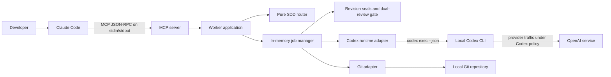

# Architecture

BoundedRelay is a single-process, local stdio MCP server. It converts bounded
MCP requests into non-interactive Codex CLI subprocesses and exposes their
lifecycle through explicit job tools.

## Design goals

- Keep the default path read-only.
- Return immediately from job submission so Claude Code can inspect progress.
- Use a supported Codex automation interface instead of scraping an interactive
  terminal.
- Make proposal authority explicit, narrow, revision-pinned, and disposable.
- Keep credentials outside the worker and minimize inherited environment data.
- Fail closed on ambiguous paths, revisions, subprocess output, and patch
  validation.
- Provide deterministic, explainable SDD task routing without making a model
  call.
- Turn an approved optional SDD route into dependency-ordered, clean-checkpoint
  execution evidence without giving BoundedRelay integration authority.
- Bind strict host and Codex reviews to the same current content-addressed
  revision seal.
- Avoid services, databases, daemons, and hidden background state in v0.1.

## System context



The MCP transport is local. Codex itself is not offline; Codex CLI controls its
authentication and provider communication.

Claude Code is the **host orchestrator**: it coordinates the user conversation,
Spec Kit commands, evidence transitions, gates, and authorized integration. The
term describes a role, not another provider model. Opus, Sonnet, or another
user-selected Claude model can power the same host role. BoundedRelay neither
starts Claude nor chooses that model.

## Components

### CLI

`src/cli.ts` exposes the established runtime operations plus two integration
inspection operations:

- `serve`: start the stdio MCP server;
- `doctor`: check executables, Codex login status, and effective policy;
- `config`: print effective non-secret configuration;
- `sdd path`: print the packaged `integrations/` path;
- `sdd validate`: verify required integration files and JSON manifests without
  installing them;
- `--help` and `--version`.

The SDD commands do not start Codex or Claude and do not write a consumer
repository. Structural validation is not a substitute for Claude Code's own
plugin validation.

The CLI refuses to start inside another worker delegation when
`CCW_DELEGATION_DEPTH` indicates a nested run.

### MCP server

`src/mcp/server.ts` owns tool schemas and annotations. It returns both a text
JSON block and structured content. Public failures have a stable `error.code`
and a sanitized message.

The proposal tool is registered only at startup when proposals are enabled. A
caller cannot enable it through tool input.

`codex_worker_sdd_route` is synchronous and pure. It validates and canonicalizes
the task DAG, evaluates eligible assignments, and returns a versioned plan and
SHA-256 fingerprint without entering the job queue. `codex_worker_sdd_review`
uses the normal queue/status/result lifecycle, but only its validated review
artifact can satisfy an SDD gate. A generic `codex_worker_analyze` result is
advisory and has no strict-gate semantics.

### Worker application

`src/worker-application.ts` composes configuration, security initialization,
executable resolution, Git operations, workspace inspection, runtime invocation,
proposal workspace handling, leases, and the job manager.

### Job manager

The job manager owns:

- an in-memory FIFO queue;
- bounded active concurrency and queue depth;
- UUID job identifiers;
- idempotency-key conflict detection;
- real event counters, sanitized activities, queue positions, and lifecycle
  revisions;
- revision-aware bounded long-poll wakeups;
- cancellation and process shutdown;
- a bounded in-memory terminal-job history.

Structured review jobs appear as normal read-only `analyze` jobs with additional
`sddReview` metadata. During finalization, the manager parses the Codex
decision, rechecks seal freshness, and stores the validated `review` artifact.
Review evidence is still process-lifetime state; the optional Spec Kit pack
persists its own bounded run evidence separately in the consumer repository's
ignored workflow directory.

There is no durable job store. Restarting the MCP server loses all job records
and idempotency keys. Running child processes are cancelled during a graceful
shutdown.

### Deterministic SDD router

The router accepts at most 64 tasks with integer effort points, risk, authority,
kind, dependencies, optional write scopes, hard eligible lanes, and a soft
preferred lane. It canonicalizes semantically equivalent input and compares
valid plans in this versioned order:

1. hard eligibility and validated graph/scope constraints;
2. minimum regret against versioned task-kind lane fit;
3. explicit `preferredLane`, but only for an exact base-fit tie;
4. absolute estimated-effort deviation from the neutral Codex share;
5. task-count deviation from that same neutral share;
6. only at a true neutral 50/50 odd tie, the extra task to Codex;
7. lexical task-ID tie-break.

The default Codex share is a neutral value of 5,000 basis points, consulted only
after equally fit and equally preferred valid plans. Output identifies both the
routing and fit policy versions and includes normalized tasks, lane-fit
evidence, decision stages, assignments, reasons, deviations, balance metrics,
dependency-safe waves, and a content fingerprint. A wave contains any ready
read-only tasks and no more than one writer. Eligibility and fit may produce any
actual share. Estimated effort is a planning input, not measured tokens, price,
latency, or quality.

Risk does not bias a lane. A critical task instead triggers the optional
workflow's cross-provider reviewer and explicit profile policy.

### Optional wave-ordered execution

The packaged Spec Kit workflow makes routing executable without turning the MCP
server into an automatic merger:

```mermaid
flowchart LR
    M[Committed tasks.md manifest<br/>all pending T### IDs] --> R[Verified routing.json<br/>exact pending-ID coverage]
    R --> E[Prepare execution.json<br/>at exact clean routing revision]
    E --> W[Run active dependency wave<br/>read-only tasks, then one writer]
    W --> C[Coordinator checks and integration<br/>one direct-child non-merge commit]
    C --> V[Verify model policy, tested tree,<br/>patch tree, diff, and dependency history]
    V -->|next wave uses completed revision| W
    V -->|all waves complete| I[Implementation review<br/>routing base .. final HEAD]
    I --> G[Fail-closed convergence audit<br/>no direct implementation]
    G -->|new pending tasks| N[Stop; fresh route and execution]
    G -->|no new work| D[No-delta dual convergence review]
    D --> P[Revalidated proof pack]
    P --> H[Isolated proof recheck<br/>atomic canonical handoff]
```



`execution.mjs prepare` accepts only complete verified routing and a clean
worktree at its exact Git revision. The Spec Kit `do-while` exposes one active
wave at a time. Dependencies must have completed in earlier waves; ready
read-only tasks use canonical task-ID order, and the wave may contain at most
one writer. Every completed wave is chained to the previous clean committed
checkpoint through its baseline/completed revisions and diff, result, and check
digests. A writer checkpoint is accepted only when it is exactly one non-merge
commit whose sole parent is the active baseline.

Routing derives a content-addressed manifest from the standard checkbox task IDs
in the committed `tasks.md` at that revision. Assignments must cover every
incomplete ID exactly once and cannot add completed or invented IDs. The
approved plan-review revision must be an ancestor of the routing checkpoint; the
`spec.md` and `plan.md` bytes must be unchanged, and the full strict review
evidence is revalidated before routing.

A Codex writer still runs only through `codex_worker_propose`. The host obtains
the exact patch, persists its bytes under the ignored run-local
`patches/<task-id>.patch`, recomputes the digest, inspects it, and performs any
authorized integration. The validator loads the baseline into a disposable Git
index, applies the persisted bytes there, and requires the resulting tree to
equal the checkpoint tree; it never uses the source worktree as the validation
target. BoundedRelay never performs source integration or commits it. Tree
equality binds content, not commit messages, authorship, or semantic
correctness.

Every Codex execution result records `model` and `reasoningEffort`, including
`null` for routed defaults, and must exact-match its routed model policy. Writer
checks are stored as redacted coordinator-attested digest receipts with zero
exit codes and `testedTree`; each must match the checkpoint tree. They are not
signed CI attestations and do not independently prove command execution.

Implementation review is bound to complete revalidated execution and compares
the routing base revision with final `HEAD`. The changed-path scope is bounded
to 256 paths. Convergence is an audit, not a second implementation phase. If it
adds pending tasks or changes the approved implementation state, verification
stops; preserving that new work requires a fresh routed and wave-executed run.
Only a no-change audit proceeds to a no-delta review at the approved
implementation revision. Any unresolved High or Critical finding blocks a strict
provider approval. A rejected human gate aborts the evidence chain; a correction
begins in a fresh workflow run rather than mutating or replaying rejected
evidence.

For implementation and convergence, the frozen host review ID is derived from
the run and phase, nonce, sealed revision, source-evidence digest, check digest,
and prepared Codex review policy. A critical task on the Claude-host lane forces
the Codex implementation/convergence cross-review policy to `gpt-5.6-sol` /
`ultra`; the profile is exact-or-refuse and never changes the user-selected
Claude host model.

### Content-addressed SDD review

Review preparation reads safe repository-relative regular files, records their
sizes and SHA-256 digests, and binds them to a workspace fingerprint. Strict
mode requires a clean tree and exact full Git revision. Draft mode permits dirty
or uncommitted state but can never pass the gate.

The caller supplies already-completed Claude host evidence. BoundedRelay
normalizes and hashes it before starting Codex. The generated Codex prompt lists
the sealed artifacts and optional neutral focus but deliberately omits the host
summary and findings. For strict mode, the worker rechecks the source, creates a
detached origin-free local clone at the sealed revision, disables hooks, proves
the clone matches the seal, then rechecks the source again. Codex runs there
fresh, ephemeral, read-only, with approvals disabled and a JSON output schema.
Draft mode intentionally remains source-based and can never approve a gate.
Finalization rejects malformed, fenced, oversized, or schema-invalid evidence
and rechecks the source workspace and every artifact. The gate is ready only
when both distinct evidence records approve the same current strict seal.

### Codex runtime adapter

The runtime starts Codex without a shell and sends the generated task prompt
over stdin. Its invocation is equivalent to:

```text
codex \
  --strict-config \
  --sandbox <read-only|workspace-write> \
  --ask-for-approval never \
  --cd <validated-execution-root> \
  [--model <allowlisted-model>] \
  [--config model_reasoning_effort=<value>] \
  exec --json --ephemeral --ignore-user-config --ignore-rules --color never \
  [--output-schema <packaged-review-schema>] -
```

The exact executable is resolved to a canonical, executable regular file before
the server starts. The runtime parses JSONL incrementally, maps events to a
fixed safe activity vocabulary, counts real events, captures the last agent
message, records reported token usage, limits combined stdout/stderr bytes, and
terminates the child process tree on cancellation or timeout.

Before `serve` accepts MCP traffic, the worker probes global and `exec` help and
refuses an installed Codex CLI that does not advertise every required flag.
`--ignore-user-config` excludes `$CODEX_HOME/config.toml`; `--ignore-rules`
excludes Codex user/project execpolicy `.rules` files. These flags do not make
repository content trusted, and authentication still uses `CODEX_HOME`.

`--output-schema` is added only for the specialized SDD review path. The startup
compatibility probe requires that flag because one connected server advertises
the complete tool surface, even when a caller intends to use only established
v0.1 tools.

Only allowlisted event identifiers may appear as `lastEventType`; every
unrecognized identifier becomes `unknown` and maps to the generic `working`
activity. Unsafe session identifiers are omitted. Raw event payloads, command
text, and tool arguments are not copied into public status. Malformed JSONL,
missing terminal events, or a successful exit without a final message fail the
job.

### Live status contract

The job manager owns the public status projection rather than forwarding Codex
events. Each material update increments an in-memory `revision` and wakes
callers waiting with the current `afterRevision`. A stale revision returns
immediately; a current revision waits only up to the caller's bounded `waitMs`.

Elapsed and silent-duration values are computed when a snapshot is returned.
They are informative clocks, not work estimates, and do not increment the
revision by themselves. The API deliberately has no percentage complete or ETA.
See [ADR 0005](adr/0005-sanitized-live-job-activity.md).

### Path and environment policy

Allowed roots and requested working directories are canonicalized. Filesystem
roots, the user's home directory, symlink directories, and state-directory
overlap are rejected. A target directory must resolve inside an allowed root and
inside an existing Git repository.

The child environment starts from an explicit allowlist. Provider-token
variables are excluded unless `CCW_FORWARD_AUTH_ENV=true`; additional names must
be listed in `CCW_FORWARD_ENV`.

### Workspace inspector

The workspace tool returns the canonical working directory, Git root, exact
`HEAD`, clean state, and proposal blockers. It performs no write.

### Proposal workspace

Proposal mode is a controlled artifact-generation lane:

```mermaid
sequenceDiagram
    participant C as Claude Code
    participant W as Worker
    participant S as Source repository
    participant T as Disposable clone
    participant X as Codex CLI

    C->>W: propose(task, expectedRevision, writePaths)
    W->>S: verify clean tree and exact HEAD
    W->>W: acquire repository proposal lease
    W->>T: local clone and detached checkout
    W->>T: remove origin and disable hooks
    W->>X: codex exec --sandbox workspace-write in clone
    X->>T: create proposed changes
    W->>T: validate HEAD, refs, paths, types, and limits
    W->>T: git diff --binary --full-index
    W->>W: delete disposable clone and release lease
    W-->>C: result metadata; patch only on explicit request
```

The clone is created with `--no-local`, `--no-checkout`, and `--no-tags`; its
remote is removed and Git hooks are disabled. The worker rejects ref or `HEAD`
changes and validates the final path set before building the patch.

The source repository is read for cloning and precondition checks. It is never
the proposal execution root and the returned patch is never applied to its
worktree by the MCP proposal path.

## Local filesystem state

`CCW_STATE_DIR` contains only operational state used by proposal and strict
review jobs:

- disposable proposal and detached strict-review clone directories;
- repository proposal leases.

It is not a job database or audit ledger. The directory is constrained to a
specific, user-owned, mode-`0700` location outside every allowed project root.
Normal proposal/review completion removes its temporary clone.

## Public data model

A public job snapshot contains lifecycle and policy facts, not the original task
body:

- job ID, revision, status, and mode;
- canonical source paths;
- optional model, reasoning effort, proposal write paths, expected revision, and
  idempotency key;
- optional SDD phase, review mode, seal ID, and frozen host-evidence digest;
- timestamps and real event counters;
- observed session ID and token usage when Codex reports them;
- result availability, truncation, and a sanitized terminal error.

The original task remains in process memory for the lifetime of its job. The
final model message and proposal artifact remain in bounded in-memory history
until eviction or server exit.

A completed SDD review may still return `gate.passed: false` with `blocked` or
`stale` status. Completion means the worker validated and evaluated the review;
it does not mean the delivery gate approved.

## Optional workflow assets

The source repository uses `.specify/` as shared development governance. The
packaged runtime does not read it. `integrations/spec-kit/` contains the
optional generic workflow, commands, evidence schemas, and validators for a
consumer repository; `integrations/claude-code-plugin/` contains host skills and
an MCP declaration. Neither is activated automatically.

The Claude lane is always `claude-host`: the model comes from the current Claude
Code session. BoundedRelay neither launches Claude nor selects or verifies its
model. Codex model overrides remain explicit and server-allowlisted. The
packaged policy requires allowlisted `gpt-5.6-sol` with `ultra` for the Codex
lane of every critical route; it fails instead of substituting another profile.

The final proof pack is assembled and immediately verified. Both operations
statically rerun the authoritative router and exact-match all routing
projections, validate the complete strict plan/implementation/convergence
evidence, replay historical wave checkpoints, exact-match the
execution-to-implementation-to-convergence source chains, and recompute current
convergence freshness. The output is a bounded digest index, not a signed
attestation or durable audit ledger.

Handoff preparation binds a run-local draft to that pack and final revision.
Verification copies the final revision and run directory into an isolated Git
clone, re-runs proof verification there, validates the draft's exact marker,
then atomically renames it to `.specify/agents/HANDOFF.md`. Retrying the same
valid publication is idempotent. This protects against partial publication; it
is not a signed attestation and cannot prevent later unrelated edits.

## Extension boundary

New transports, persistence, automatic patch application, remote execution, and
cryptographic audit claims are architecture changes, not small features. They
require a new ADR, threat-model update, tests, and explicit documentation before
implementation.

See [ADRs](adr/README.md) for the decisions behind the current boundary.
