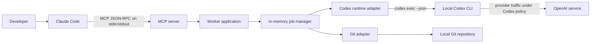

# Architecture

BoundedRelay is a single-process, local stdio MCP server. It converts bounded
MCP requests into non-interactive Codex CLI subprocesses and exposes their
lifecycle through explicit job tools.

## Design goals

- Keep the default path read-only.
- Return immediately from job submission so Claude Code can inspect progress.
- Use a supported Codex automation interface instead of scraping an interactive
  terminal.
- Make proposal authority explicit, narrow, revision-pinned, and disposable.
- Keep credentials outside the worker and minimize inherited environment data.
- Fail closed on ambiguous paths, revisions, subprocess output, and patch
  validation.
- Avoid services, databases, daemons, and hidden background state in v0.1.

## System context



The MCP transport is local. Codex itself is not offline; Codex CLI controls its
authentication and provider communication.

## Components

### CLI

`src/cli.ts` exposes four operations:

- `serve`: start the stdio MCP server;
- `doctor`: check executables, Codex login status, and effective policy;
- `config`: print effective non-secret configuration;
- `--help` and `--version`.

The CLI refuses to start inside another worker delegation when
`CCW_DELEGATION_DEPTH` indicates a nested run.

### MCP server

`src/mcp/server.ts` owns tool schemas and annotations. It returns both a text
JSON block and structured content. Public failures have a stable `error.code`
and a sanitized message.

The proposal tool is registered only at startup when proposals are enabled. A
caller cannot enable it through tool input.

### Worker application

`src/worker-application.ts` composes configuration, security initialization,
executable resolution, Git operations, workspace inspection, runtime invocation,
proposal workspace handling, leases, and the job manager.

### Job manager

The job manager owns:

- an in-memory FIFO queue;
- bounded active concurrency and queue depth;
- UUID job identifiers;
- idempotency-key conflict detection;
- real event counters, sanitized activities, queue positions, and lifecycle
  revisions;
- revision-aware bounded long-poll wakeups;
- cancellation and process shutdown;
- a bounded in-memory terminal-job history.

There is no durable job store. Restarting the MCP server loses all job records
and idempotency keys. Running child processes are cancelled during a graceful
shutdown.

### Codex runtime adapter

The runtime starts Codex without a shell and sends the generated task prompt
over stdin. Its invocation is equivalent to:

```text
codex \
  --strict-config \
  --sandbox <read-only|workspace-write> \
  --ask-for-approval never \
  --cd <validated-execution-root> \
  [--model <allowlisted-model>] \
  [--config model_reasoning_effort=<value>] \
  exec --json --ephemeral --ignore-user-config --ignore-rules --color never -
```

The exact executable is resolved to a canonical, executable regular file before
the server starts. The runtime parses JSONL incrementally, maps events to a
fixed safe activity vocabulary, counts real events, captures the last agent
message, records reported token usage, limits combined stdout/stderr bytes, and
terminates the child process tree on cancellation or timeout.

Before `serve` accepts MCP traffic, the worker probes global and `exec` help and
refuses an installed Codex CLI that does not advertise every required flag.
`--ignore-user-config` excludes `$CODEX_HOME/config.toml`; `--ignore-rules`
excludes Codex user/project execpolicy `.rules` files. These flags do not make
repository content trusted, and authentication still uses `CODEX_HOME`.

Only allowlisted event identifiers may appear as `lastEventType`; every
unrecognized identifier becomes `unknown` and maps to the generic `working`
activity. Unsafe session identifiers are omitted. Raw event payloads, command
text, and tool arguments are not copied into public status. Malformed JSONL,
missing terminal events, or a successful exit without a final message fail the
job.

### Live status contract

The job manager owns the public status projection rather than forwarding Codex
events. Each material update increments an in-memory `revision` and wakes
callers waiting with the current `afterRevision`. A stale revision returns
immediately; a current revision waits only up to the caller's bounded `waitMs`.

Elapsed and silent-duration values are computed when a snapshot is returned.
They are informative clocks, not work estimates, and do not increment the
revision by themselves. The API deliberately has no percentage complete or ETA.
See [ADR 0005](adr/0005-sanitized-live-job-activity.md).

### Path and environment policy

Allowed roots and requested working directories are canonicalized. Filesystem
roots, the user's home directory, symlink directories, and state-directory
overlap are rejected. A target directory must resolve inside an allowed root and
inside an existing Git repository.

The child environment starts from an explicit allowlist. Provider-token
variables are excluded unless `CCW_FORWARD_AUTH_ENV=true`; additional names must
be listed in `CCW_FORWARD_ENV`.

### Workspace inspector

The workspace tool returns the canonical working directory, Git root, exact
`HEAD`, clean state, and proposal blockers. It performs no write.

### Proposal workspace

Proposal mode is a controlled artifact-generation lane:

```mermaid
sequenceDiagram
    participant C as Claude Code
    participant W as Worker
    participant S as Source repository
    participant T as Disposable clone
    participant X as Codex CLI

    C->>W: propose(task, expectedRevision, writePaths)
    W->>S: verify clean tree and exact HEAD
    W->>W: acquire repository proposal lease
    W->>T: local clone and detached checkout
    W->>T: remove origin and disable hooks
    W->>X: codex exec --sandbox workspace-write in clone
    X->>T: create proposed changes
    W->>T: validate HEAD, refs, paths, types, and limits
    W->>T: git diff --binary --full-index
    W->>W: delete disposable clone and release lease
    W-->>C: result metadata; patch only on explicit request
```

The clone is created with `--no-local`, `--no-checkout`, and `--no-tags`; its
remote is removed and Git hooks are disabled. The worker rejects ref or `HEAD`
changes and validates the final path set before building the patch.

The source repository is read for cloning and precondition checks. It is never
the proposal execution root and the returned patch is never applied.

## Local filesystem state

`CCW_STATE_DIR` contains only operational state used by proposal jobs:

- disposable clone directories;
- repository proposal leases.

It is not a job database or audit ledger. The directory is constrained to a
specific, user-owned, mode-`0700` location outside every allowed project root.
Normal proposal completion removes its temporary clone.

## Public data model

A public job snapshot contains lifecycle and policy facts, not the original task
body:

- job ID, revision, status, and mode;
- canonical source paths;
- optional model, reasoning effort, proposal write paths, expected revision, and
  idempotency key;
- timestamps and real event counters;
- observed session ID and token usage when Codex reports them;
- result availability, truncation, and a sanitized terminal error.

The original task remains in process memory for the lifetime of its job. The
final model message and proposal artifact remain in bounded in-memory history
until eviction or server exit.

## Extension boundary

New transports, persistence, automatic patch application, remote execution, and
cryptographic audit claims are architecture changes, not small features. They
require a new ADR, threat-model update, tests, and explicit documentation before
implementation.

See [ADRs](adr/README.md) for the decisions behind the current boundary.
